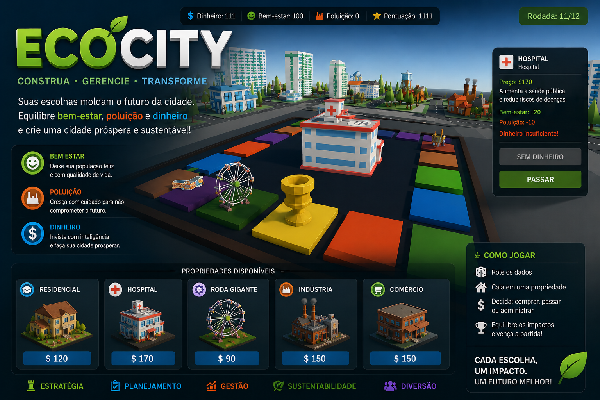

# FECAP - Fundação de Comércio Álvares Penteado

<p align="center">
<a href= "https://www.fecap.br/"></a>
</p>

# Eco City

## Eco City

## Integrantes: <a href="https://www.linkedin.com/in/leonardo-fran%C3%A7a-68bb97349/">Leonardo Batista França </a>, <a href="https://github.com/ArthurLdl">Arthur Lima de Luiz </a>, <a href="https://github.com/Brianwalter-q">Brian Walter</a>


## Professores Orientadores: <a href="https://www.linkedin.com/in/victorbarq/" target="_blank" rel="noopener noreferrer">Victor Bruno Alexander Rosetti de Quiroz</a>, <a href="https://www.linkedin.com/in/remuniz/" target="_blank" rel="noopener noreferrer">Renata Muniz Do Nascimento</a>, <a href="https://www.linkedin.com/in/adriano-valente-534576135/" target="_blank" rel="noopener noreferrer">Adriano Felix Valente</a>, <a href="https://www.linkedin.com/in/eduardo-savino-gomes-77833a10/" target="_blank" rel="noopener noreferrer">Eduardo Savino Gomes</a>, <a href="https://www.linkedin.com/in/luisspires/" target="_blank" rel="noopener noreferrer">Luis Fernando dos Santos Pires</a>

## Descrição

<p align="center">

  Game by <a href="http://www.nyphotographic.com/">Arthur Lima de Luiz, Brian Walter, Leonardo Batista França </a> <a rel="license" href="https://creativecommons.org/licenses/by/4.0/">CC BY 4.0</a>

O EcoCity surgiu como uma proposta divertida de conscientização sobre sustentabilidade. Em formato de tabuleiro digital, o jogo permite que o jogador gerencie uma cidade enquanto equilibra dinheiro, bem-estar da população e níveis de poluição.

Suas decisões definem o futuro da cidade: priorizar apenas o lucro pode trazer consequências ambientais graves, enquanto uma gestão equilibrada pode transformar EcoCity em um exemplo de desenvolvimento sustentável.
Planeje, invista e descubra até onde sua cidade pode evoluir. Venha conhecer o EcoCity!
<br><br>

O repositório reúne tanto a versão de desenvolvimento construída ao longo da Entrega 1 quanto a versão final organizada na Entrega 2, além dos documentos acadêmicos e materiais complementares do projeto.

## 🛠 Estrutura de pastas

```text
Projeto10
├── Documentos
│   ├── Entrega 1
│   │   ├── Algoritimo e lógica de programação
│   │   ├── Cálculo I
│   │   ├── Jogos Digitais e Sistemas Digitais Interativos
│   │   ├── Projeto Interdisciplinar Jogos Digitais
│   │   └── Ética e pensamento computacional
│   ├── Entrega 2
│   │   ├── Algoritimos e logica de programação
│   │   ├── Cálculo I
│   │   ├── Jogos Digitais e Sistemas Digitais Interativos
│   │   ├── Projeto Interdisciplinar Jogos Digitais
│   │   └── Ética e pensamento computacional
│   ├── BANNER Eco City .pptx.pdf
│   ├── Documento - Projeto de Extensão - COM Empresa - Eco City (1).docx
│   ├── Documento - Projeto de Extensão - COM Empresa - Eco City (1).pdf
│   └── README.md
├── Executáveis
│   ├── Link para acesso Web.txt
│   └── Link para download.txt
├── Imagens
│ 
├── src
│   ├── Entrega 1
│   │   ├── Backend
│   │   └── Frontend
│   │       └── Eco City Desenvolvimento
│   └── Entrega 2
│       ├── Backend
│       └── Frontend
│           └── EcoCity1
├── .gitignore
└── README.md
```

A pasta raiz contém os principais arquivos e diretórios do projeto:

README.md: Arquivo que serve como guia e explicação geral sobre o projeto.

Documentos: Toda a documentação acadêmica e os materiais das entregas estão nesta pasta.

Executáveis: Pasta com os links de acesso e distribuição da versão jogável.

Imagens: Imagens do sistema, capturas de tela e materiais visuais do projeto.

src: Pasta que contém o código-fonte, a versão de desenvolvimento da Entrega 1 e a versão final da Entrega 2.

## 🛠 Instalação

<b>Windows:</b>

Para acessar o projeto em um computador com Windows, utilize o arquivo de link disponível na pasta `Executável`:

```sh
Executável/Link para download.txt
```

Após baixar os arquivos do projeto no seu computador, extraia o conteúdo em uma pasta local para poder abrir o projeto no Unity Editor.

<b>Web:</b>

Não há instalação local obrigatória para jogar a versão publicada.
Acesse o arquivo de link disponível na pasta `Executável`:

```sh
Executável/Link para acesso Web.txt
```

## 💻 Configuração para Desenvolvimento

Para abrir este projeto você necessita das seguintes ferramentas:

- <a href="https://unity.com/download">Unity Hub</a>
- Unity Editor 6000.3.6f1

```sh
1. Baixe ou clone este repositório no seu computador
2. Instale o Unity Hub
3. Instale a versão 6000.3.6f1 do Unity Editor
4. Abra o Unity Hub
5. Clique em Add project
6. Selecione a pasta `src/Entrega 2/Frontend/EcoCity1`
7. Abra o projeto com a versão 6000.3.6f1
8. Aguarde a Unity importar os arquivos e reconstruir os arquivos temporários automaticamente
```

## 📋 Licença/License
<a href="https://example.com">Eco City</a> © 2026 by <a href="https://example.com">Leonardo Batista França, Arthur Lima de Luiz, Brian Walter e FECAP</a> is licensed under <a href="https://creativecommons.org/licenses/by/4.0/">CC BY 4.0</a>

## 🎓 Referências

Aqui estão as referências usadas no projeto.

1. <https://github.com/iuricode/readme-template>
2. <https://github.com/gabrieldejesus/readme-model>
3. <https://chooser-beta.creativecommons.org/>
4. <https://www.toptal.com/developers/gitignore>
5. <https://stocksnap.io/photo/idea-brain-5NLKT00MVB>
6. <https://github.com/googlesamples/unity-jar-resolver>
7. <https://marketplace.unity.com/packages/3d/props/exterior/low-poly-houses-free-pack-243926>
8. <https://assetstore-fallback.unity.com/packages/3d/environments/urban/low-poly-buildings-with-multiple-color-schemes-colorful-city-169972?locale=ko-KR>
9. <https://marketplace.unity.com/packages/3d/environments/simple-generic-buildings-cartoon-buildings-266743>
10. <https://marketplace.unity.com/packages/3d/props/industrial/high-quality-solar-panel-175231>
11. <https://assetstore-fallback.unity.com/packages/3d/props/board-game-essentials-chess-checkers-dice-284152>
